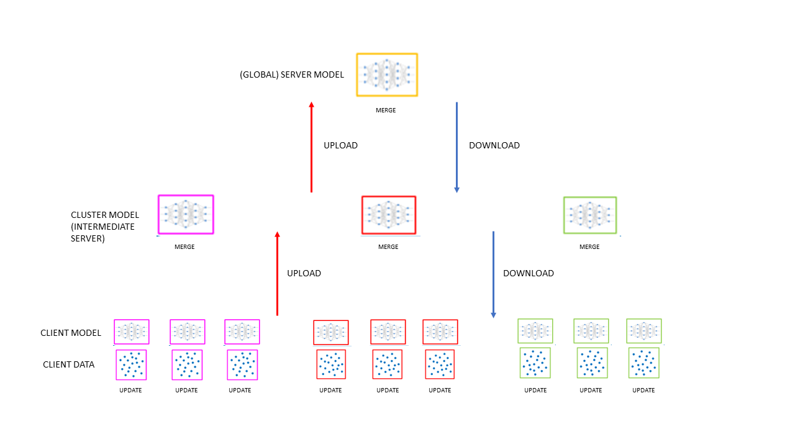

# Multilevel-Federated-Learning
Proof of Concept - Multilevel Federated Learning (extended from the Google's original paper).

Resume:

N clusters.
ci[j] = client j of cluster i.
Ni = Number of clients in cluster i.
ci[j][k] = sample k of client j of cluster i.

                                                        Global Server

        Cluster1        |       Cluster2        |       ...       |           Clusteri        |           ...        |       ClusterN

    c1[1] c1[2] .. c1[N1]            ...                   ...          ci[1] ci[2] .. ci[Ni]              ...

Cluster Info:

    num_clients: total number of clients.
    N: num_clusters: number of clusters.
    global_rounds: federated rounds between (Global)Server and the N clusters.
    cluster_rounds: federated rounds between each cluster* and its clients. (FW: can be only a fraction) 
    local_epoch: number of epochs of learning inside each client.

Data distribution:

    Between clusters: by client index. 
        E.g.
        10 clusters, 100 clients: cluster0 has 0 to 9.
        
    iid parameter: 

        0 - IID
        1 - 8 shards per client.
        2 - 4 shards per client.
        3 - 2 shards per client.

        Divides the dataset in as many shards as needed (e.g. 800, 8 shards per client and 100 clients) with the dataset ordered 
        by labels and assigns to each client 8,4 or 2 shards randomly. 

    unequal:

        Assings a minimum of 1 shard to each client and then assigns them randomly allowing some clients to have more shards.
